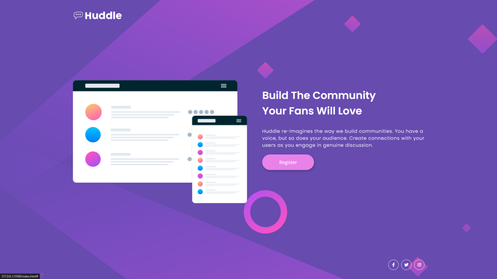

# Frontend Mentor - Huddle landing page with single introductory section solution

This is a solution to the [Huddle landing page with single introductory section challenge on Frontend Mentor](https://www.frontendmentor.io/challenges/huddle-landing-page-with-a-single-introductory-section-B_2Wvxgi0). Frontend Mentor challenges help you improve your coding skills by building realistic projects. 

## Table of contents

- [Frontend Mentor - Huddle landing page with single introductory section solution](#frontend-mentor---huddle-landing-page-with-single-introductory-section-solution)
  - [Table of contents](#table-of-contents)
  - [Overview](#overview)
    - [The challenge](#the-challenge)
    - [Screenshot](#screenshot)
    - [Links](#links)
  - [My process](#my-process)
    - [Built with](#built-with)
    - [What I learned](#what-i-learned)
    - [Continued development](#continued-development)
  - [Author](#author)
  - [Acknowledgments](#acknowledgments)
## Overview

### The challenge

Users should be able to:

- View the optimal layout depending on their device's screen size
- See hover states for interactive elements

### Screenshot



### Links

- Solution URL: [https://github.com/KrzysztofGrudzien/frontend-mentor-huddle-landing-page](https://github.com/KrzysztofGrudzien/frontend-mentor-huddle-landing-page)
- Live Site URL: [https://krzysztofgrudzien.github.io/frontend-mentor-huddle-landing-page/](https://krzysztofgrudzien.github.io/frontend-mentor-huddle-landing-page/)

## My process

### Built with

- Semantic HTML5 markup
- CSS custom properties
- CSS Flexbox
- Mobile-first workflow
- BEM Methodology
- [Font Awesome](https://fontawesome.com/)

### What I learned

In this project, I tried to repeat my knowledge about pure HTML and CSS. As an additional tip, I used CSS properties and BEM Methodology.

Few lines of code from the project:

```html
  <div class="container">
    <header class="header">
        <h1 class="header__title"></h1>
    </header>
    <main class="main">
        <section class="about" id="about">
            <div class="about__img-wrapper">
                
            </div>
            <div class="about__content">
                <h2 class="about__title">Build The Community Your Fans Will Love</h2>
                <p class="about__description">
                    Huddle re-imagines the way we build communities. You have a voice, but so does your
                    audience. Create connections with your users as you engage in genuine discussion.
                </p>
                <a href="#" class="about__link">Register</a>
            </div>
        </section>
    </main>
    <footer class="footer">
        <div class="footer__links">
            <a href="#" class="footer__link"><i class="fab fa-facebook-f"></i></a>
            <a href="#" class="footer__link"><i class="fab fa-twitter"></i></a>
            <a href="#" class="footer__link"><i class="fab fa-instagram"></i></a>
        </div>
    </footer>
</div>
```
```css
      .header__logo {
        width: 200px;
    }

    .footer__links {
        justify-content: flex-end;
    }

    .footer__link:link,
    .footer__link:active,
    .footer__link:visited {
        height: 4rem;
        font-size: 1.6rem;
        width: 4rem;
    }

    .footer__link:link,
    .footer__link:active,
    .footer__link:visited {
        transition: border 0.3s ease, color 0.3s ease, filter 0.3s ease;
    }

    .footer__link:hover {
        border: 1px solid var(--color-secondary);
        color: var(--color-secondary);
        filter: saturate(3);
    }

```

### Continued development

## Author

- Website - [In progress]
- Frontend Mentor - [@KrzysztofGrudzien](https://www.frontendmentor.io/profile/KrzysztofGrudzien)
- E-mail - krzysztof.grudzien.fed@gmail.com

## Acknowledgments
